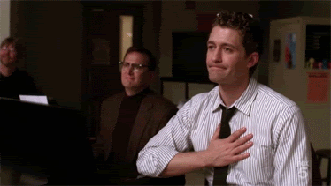
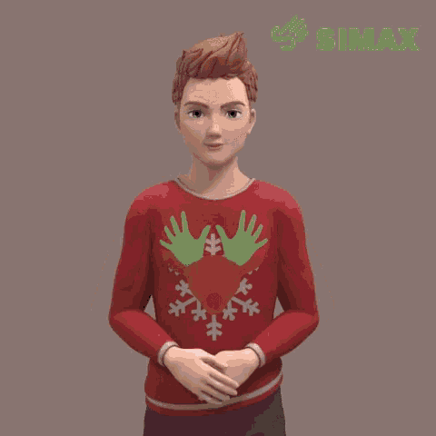
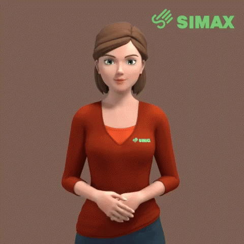

# Mudra

**A simple ML and AI-powered tool to build a louder world for differently-abled deaf people.**

## Inspiration
Hearing challenges affect all ages, races, and ethnicities, from the entire spectrum of socioeconomic and geographic backgrounds. Some people were born deaf, some lost hearing as a result of a medical condition, illness, time, or trauma.

*We don’t know exactly how many people in the United States use ASL, but estimates range from 100,000 to 1 million.*
  

## What it does
Mudra aims to bridge the gap between people facing difficulty in understanding American Standard Language (ASL) and those who are unable to hear well.

## How we built it
We are using React's `fingerpose` library to detect each finger on the palm and give output in terms of an emoji.

## Challenges we ran into
Making a model which correctly depicts the gestures is pretty difficult when fine-tuning the performance of Web-Application.

## Accomplishments that we're proud of
The model can correctly predict **3 gestures** successfully with high-level accuracy.
For demonstration purposes I was aiming to predict just 1 or 2 gestures, as models take time to build, training and iterating over failed attempts is tedious.
However, as a good start, 3 is satisfactory and for me, it's been GREAT!

## What we learned
I had not worked on ML integration with ReactJS ever before. It is pretty fascinating how simple things can work out well just by developing a strong front-end.

## What's next for Mudra
Today, we can recognize 3 gestures pretty well. We aim to develop an entire revolution where everything ASL has to offer, can be inculcated into one tiny Web-App. We aim to reduce the communication gap between people all across the world, which will lead to a more inclusive society.
  

